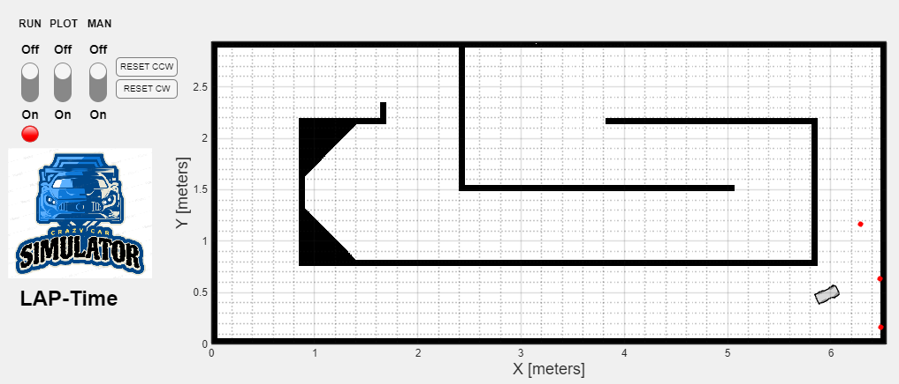

# CrazyCar-Simulator 0.9a
==========================

### Instructions for Porting Your Algorithm to the Simulator as C-Code

1.  **Install a C-Compiler in MATLAB**
    
    *   Open MATLAB and go to the "Add-Ons" menu.
    *   Search for and install the **MinGW64** Add-On.

        'Instrument Control Toolbox' 
        'Lidar Toolbox' 
        'Navigation Toolbox' 
        'Robotics System Toolbox' 
        'ROS Toolbox'
        
2.  **Configure the Compiler**
    
    *   Open the MATLAB Command Window.  
    *   arduinoCode kopierenmex -setup C        
    *   This sets up MinGW as the default C-compiler.       
    *   For Mac users, ensure you have installed the **XCode Command Line Tools** or appropriate XCode support.
        
3.  **Understand the Role of mex**
    
    *   The mex command compiles C-code into a MATLAB function.        
    *   Place your C-files in the folder called +algorithm.
        
4.  **Note:** The simulator does not execute in real-time but simulates with time steps.
    
    *   bashCode kopieren +algorithm/mex\_main.c **Do not modify this file.**        
    *   bashCode kopieren +algorithm/c\_files/algo.c In this file, you will receive the following inputs:
        
        *   Sensor data (in millimeters),            
        *   The number of ticks,            
        *   The frequency of the algorithm (or simulator).
            
5.  **Static Values**
    
    *   Any global static values in your code will persist until you press the **RESET** button in the simulator.
        
6.  **Start the Simulator**
    
    *   Code kopierenstartSim.m
        
7.  **Check Required Toolboxes**
    
    *   scssCode kopierenenv.checkToolboxes();        
    *   If any toolbox is missing, it will be listed in the MATLAB Command Window. Use the "Add-Ons" menu to install missing toolboxes.
        

**Note:** There is no debugger for MEX files, so you must debug issues manually by reviewing the errors shown during compilation.

1.  Use the function mexSuppport.runMex to compile all C-modules in the +algorithm folder into MATLAB functions.    
2.  If there are errors in your C-code, they will be displayed in the MATLAB Command Window during the build process.
    

### What is Simulated?

*   DC motor engine    
*   Steering Servo    
*   Body of the car    
*   Tyres    
*   Infrared-Sensors (IR)    
*   Crash detection    
*   LAP-Time    
*   UDP Connection → Control the simulator via IP

=====================================================================================
This program is free software: you can redistribute it and/or modify  
it under the terms of the GNU General Public License as published by  
the Free Software Foundation, either version 3 of the License, or  
(at your option) any later version.

This program is distributed in the hope that it will be useful,  
but WITHOUT ANY WARRANTY; without even the implied warranty of  
MERCHANTABILITY or FITNESS FOR A PARTICULAR PURPOSE. See the  
GNU General Public License for more details.

You should have received a copy of the GNU General Public License  
along with this program. If not, see <https://www.gnu.org/licenses/>.

Additional Terms (as permitted by Section 7 of the GPLv3):
----------------------------------------------------------
1. **Attribution Requirement**:  
   If you distribute this software (modified or unmodified), you must provide appropriate credit to the original author(s) in a clear and visible manner (e.g., in documentation, about pages, or README files). This includes the name of the project and a link to the original source repository or website, if applicable.

2. **No Misrepresentation**:  
   You may not misrepresent the origin of the software. You must not claim that you wrote the original software, nor may you imply that your modified version is the original work. Modified versions must be clearly marked as such.

----------------------------------------------------------

© [2020] [CrazyCarSim]
